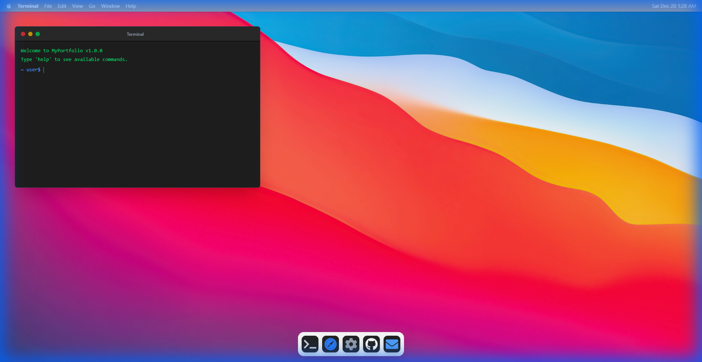

# MacOS Style Portfolio 🍎

> A fully functional, interactive personal portfolio website designed to mimic the look and feel of MacOS Big Sur. Built with **React**, **Tailwind CSS**, and **Vite**.



## 🌟 Features

- **🖥️ Desktop Environment**: Full-screen desktop experience with dynamic background.
- **⚡ Super Fast**: Powered by Vite for lightning-fast HMR and bundling.
- **🎨 Tailwind CSS v4**: Utilizes the latest utility-first CSS framework for pixel-perfect design.
- **🖱️ Interactive Dock**: Animated dock providing easy access to applications.
- **🪟 Windows System**: Draggable window architecture allowing multiple apps to be open simultaneously.
- **🍎 Authentic Look**: Custom Menu Bar, Traffic Light controls (Close/Min/Max), and San Francisco-style typography.

## 📱 Included Apps

- **Terminal**: A geeky way to introduce yourself. Type commands to learn more!
- **Safari**: A browser-like interface to showcase your projects and work.
- **Settings**: Control center to toggle system preferences.
- **Mail**: (Link) Quick access to email.
- **Github**: (Link) Direct link to source code.

## 🛠️ Tech Stack

- **Framework**: [React 19](https://react.dev/)
- **Build Tool**: [Vite](https://vitejs.dev/)
- **Styling**: [Tailwind CSS v4](https://tailwindcss.com/)
- **Animations**: CSS Transitions & Transforms (GSAP-style feel)
- **Icons**: [React Icons](https://react-icons.github.io/react-icons/)
- **Utils**: `date-fns`, `react-draggable`

## 🚀 Getting Started

Follow these steps to run the project locally:

### Prerequisites

- Node.js (Latest LTS version recommended)
- npm or yarn

### Installation

1. **Clone the repository**
   ```bash
   git clone https://github.com/digantabose/macos-portfolio.git
   cd macos-portfolio
   ```

2. **Install dependencies**
   ```bash
   npm install
   ```

3. **Run the development server**
   ```bash
   npm run dev
   ```

4. **Open in browser**
   Visit `http://localhost:5173` to view the app.

## 📦 Building for Production

To create a production-ready build:

```bash
npm run build
```

## 🤝 Contributing

Contributions are welcome! Please feel free to submit a Pull Request.

## 📄 License

This project is open source and available under the [MIT License](LICENSE).
